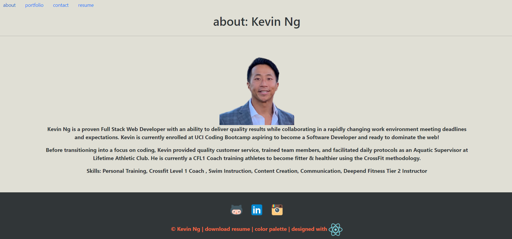
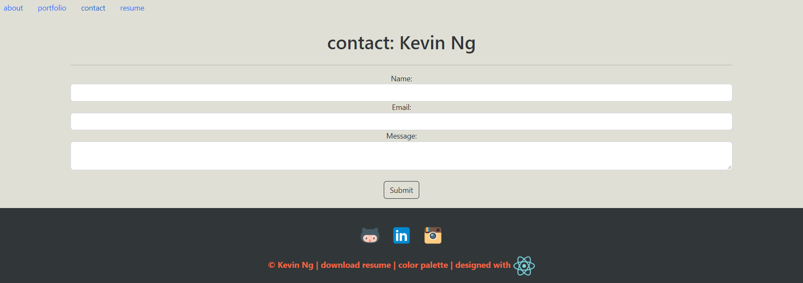

## React Portfolio
My name is Kevin Ng and I'm a web developer based in Orange County, California. Having spent a majority of my life in health and wellness, I've decided to shift gears into web design and technology. I'm an exceptionally creative and reliable Software Engineer with a proven background in customer service and a driven work ethic. I'm a disciplined professional with a proven ability to deliver quality results while collaborating in a rapidly changing work environment meeting deadlines and expectations. I have a strong desire and willingness to learn.

## Description
This project was bootstrapped with [Create React App](https://github.com/facebook/create-react-app). This portfolio website is built with React. It is a fully interactive terminal inspired portfolio page. Highlights include: React, JSX, CSS, and Bootstrap. It features a single header component that navigates and renders out About, Projects, Contact, and Resume sections. 

## Link to the App
* ['React-Portfolio - Github'](https://github.com/KevinNg2/React-Portfolio)
* ['Kevin Ng's React Portfolio'](https://kevinng2.github.io/React-Portfolio/)




## User Story

```
AS AN employer looking for candidates with experience building single-page applications
I WANT to view a potential employee's deployed React portfolio of work samples
SO THAT I can assess whether they're a good candidate for an open position
```

## Usage
This project features the following available scripts. 
In the project directory, run the commands:
`npm i` in your terminal to install the proper dependencies 

`npm start` runs the app in the development mode. Open [http://localhost:3000](http://localhost:3000) to view it in the browser.

`npm test` Launches the test runner in the interactive watch mode. Navigate to [running tests](https://facebook.github.io/create-react-app/docs/running-tests) for more information.
 
 `npm run build` Builds the app for production to the build folder. It bundles React in production mode for the best performance.

The build is minified and the filenames include the hashes. Now the app is ready to be deployed. 

For more information on deployment, [click here](https://facebook.github.io/create-react-app/docs/deployment).

Deploy your portfolio page using `gh-pages` and `npm run deploy`.

## Credits
Kevin Ng UCI Coding Bootcamp

## Contact
- GitHub: [KevinNg2](https://github.com/KevinNg2)
- Email: [kevinng3292@gmail.com](mailto:kevinng3292@gmail.com)

